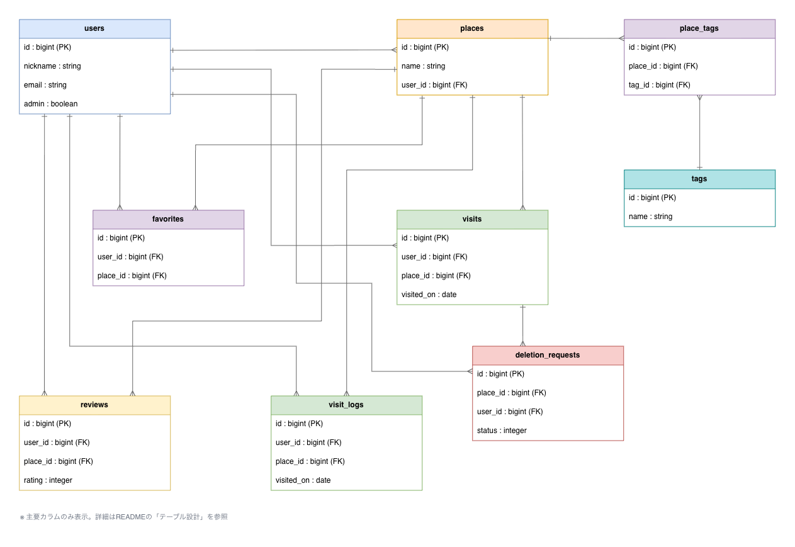
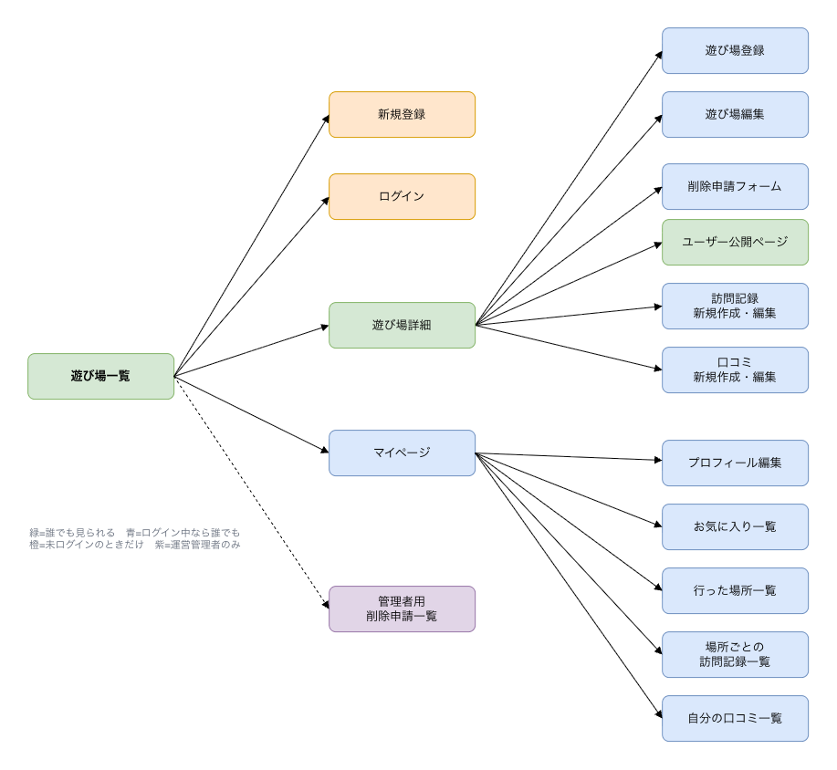

# あそびログ

「今日、どこ行く？」に、もう迷わない。子どもとのお出かけ先を探して、記録するアプリです。

## 目次

- [開発背景・解決したい課題](#開発背景解決したい課題)
- [ターゲットユーザー](#ターゲットユーザー)
- [主な機能](#主な機能)
- [使用技術](#使用技術)
- [ER図](#er図)
- [テーブル設計](#テーブル設計)
- [画面一覧](#画面一覧)
- [画面遷移図](#画面遷移図)
- [セットアップ方法](#セットアップ方法)
- [工夫した点](#工夫した点)
- [苦労した点・学んだこと](#苦労した点学んだこと)
- [今後追加したい機能](#今後追加したい機能)
- [URL](#url)

---

## 開発背景・解決したい課題

休日、子どもをどこへ連れて行くか考えるのに毎回時間がかかる——という身近な悩みを解決するために開発しました。

具体的には、以下のような課題があります。

- 子どもの年齢に合う遊び場を探すのに時間がかかる
- 屋内か屋外か、料金がいくらかが事前に分かりにくい
- 一度行った場所を忘れてしまい、「また行きたい場所」を管理できていない

「あそびログ」では、条件検索・お気に入り登録・訪問記録の3つの機能でこれらを解決します。

## ターゲットユーザー

未就学児〜小学校低学年の子どもを持つ保護者。特に、休日の外出先選びに時間を取られている家庭を想定しています。

## 主な機能

| 機能 | 内容 |
|---|---|
| 会員登録・ログイン・ログアウト | `bcrypt`によるパスワードのハッシュ化、`session`によるログイン状態の管理 |
| 遊び場のCRUD | 一覧・詳細の閲覧、登録・編集・削除（本人のみ編集・削除可） |
| 検索・絞り込み | キーワード（名前・説明文）、カテゴリ、屋内/屋外、対象年齢での絞り込み。複数条件の組み合わせに対応 |
| お気に入り機能 | 気になる遊び場をお気に入り登録し、一覧で確認できる |
| 「行った」記録 | 実際に訪問した遊び場を記録し、一覧で振り返れる |
| マイページ | 件数サマリー・自分が登録した遊び場一覧の表示、プロフィール編集、退会 |
| Basic認証 | 本番環境全体をID・パスワードで保護（開発途中のため） |
| 自動テスト | Minitestによるモデルの基本的なバリデーション・認証テスト |

## 使用技術

- Ruby 3.2.0
- Ruby on Rails 7.1.6
- PostgreSQL 14
- bcrypt（パスワードのハッシュ化）
- Turbo / Stimulus（Rails標準のHotwire構成）
- Git / GitHub（機能ごとのブランチ・Pull Requestによる開発）
- Render（本番デプロイ先）
- AWS（Render安定稼働後に移行予定）

## ER図



編集用のソースは [`docs/images/er-diagram.drawio`](docs/images/er-diagram.drawio)（Draw.io / diagrams.net）です。

## テーブル設計

### users

| カラム名 | 型 | NOT NULL | 備考 |
|---|---|---|---|
| id | bigint | ○ | 主キー |
| name | string | ○ | ニックネーム |
| email | string | ○ | 一意制約あり |
| password_digest | string | ○ | `has_secure_password`によりハッシュ化して保存 |

### places

| カラム名 | 型 | NOT NULL | デフォルト | 備考 |
|---|---|---|---|---|
| id | bigint | ○ | - | 主キー |
| name | string | ○ | - | 遊び場名 |
| description | text | - | - | 説明 |
| address | string | ○ | - | 住所 |
| category | integer | ○ | 0 | enum（park / indoor_facility / museum / aquarium_zoo / other） |
| indoor_outdoor | integer | ○ | 0 | enum（indoor / outdoor / both） |
| min_age / max_age | integer | - | - | 対象年齢の下限・上限 |
| price | string | - | - | 料金 |
| business_hours | string | - | - | 営業時間 |
| user_id | bigint | ○ | - | 外部キー（登録したユーザー） |

### favorites（中間テーブル）

| カラム名 | 型 | NOT NULL | 備考 |
|---|---|---|---|
| id | bigint | ○ | 主キー |
| user_id | bigint | ○ | 外部キー |
| place_id | bigint | ○ | 外部キー |

`[user_id, place_id]`に一意制約を設定し、同じ場所への重複お気に入り登録を防止しています。

### visits（中間テーブル）

| カラム名 | 型 | NOT NULL | 備考 |
|---|---|---|---|
| id | bigint | ○ | 主キー |
| user_id | bigint | ○ | 外部キー |
| place_id | bigint | ○ | 外部キー |
| visited_on | date | - | 訪問日 |

`favorites`と同様に`[user_id, place_id]`に一意制約を設定しています。

### アソシエーション概要

- `User has_many :places`（1人のユーザーは複数の遊び場を登録できる）
- `User has_many :favorites` / `has_many :favorite_places, through: :favorites`（お気に入りを通じて複数の遊び場と多対多）
- `User has_many :visits` / `has_many :visited_places, through: :visits`（訪問記録を通じて複数の遊び場と多対多）
- `Place belongs_to :user`
- `Place has_many :favorites` / `has_many :visits`
- `Favorite belongs_to :user` / `belongs_to :place`
- `Visit belongs_to :user` / `belongs_to :place`

## 画面一覧

| No. | 画面 | 概要 |
|---|---|---|
| 1 | 遊び場一覧（トップページ） | 検索フォーム＋一覧表示 |
| 2 | 遊び場詳細 | 詳細情報、お気に入り/「行った」ボタン、編集・削除リンク（本人のみ） |
| 3 | 遊び場登録 | ログインユーザーのみアクセス可 |
| 4 | 遊び場編集 | 登録者本人のみアクセス可 |
| 5 | 新規登録 | 会員登録フォーム |
| 6 | ログイン | ログインフォーム |
| 7 | お気に入り一覧 | ログイン中のユーザーがお気に入り登録した遊び場の一覧 |
| 8 | 行った場所一覧 | ログイン中のユーザーが「行った」記録をした遊び場の一覧 |
| 9 | マイページ | 件数サマリー・自分が登録した遊び場一覧 |
| 10 | プロフィール編集 | 名前・メール・パスワードの変更、退会 |

## 画面遷移図



編集用のソースは [`docs/images/screen-flow.drawio`](docs/images/screen-flow.drawio)（Draw.io / diagrams.net）です。

## セットアップ方法

```bash
# リポジトリをクローン
git clone https://github.com/bluewell-y/asobi-log.git
cd asobi-log

# gemをインストール
bundle install

# データベースを作成・マイグレーション
bin/rails db:create
bin/rails db:migrate

# サーバーを起動
bin/rails server
```

`http://localhost:3000` にアクセスして動作を確認できます。事前にPostgreSQLがローカルで起動している必要があります（`brew services start postgresql@14` など）。

## 工夫した点

- パスワードは`has_secure_password`（bcrypt）でハッシュ化し、平文で保存しないようにしています。
- 遊び場の編集・削除は「ログイン必須」に加え「登録者本人のみ」に制限し、`before_action`による権限チェック（`require_login` / `require_owner`）を実装しています。
- 検索・絞り込みは`scope`を使って条件ごとに分割し、自由に組み合わせて絞り込めるようにしています（キーワード・カテゴリ・屋内外・対象年齢）。
- カテゴリ・屋内外は`enum`で管理しつつ、表示用に`category_label`/`indoor_outdoor_label`メソッドを用意し、DB上は数値・コード上は名前・画面上は日本語、と役割を分離しています。
- プロフィール更新・退会は`current_user`のみを対象にし、URLのIDに依存しない実装にすることで、他人のアカウントを誤って操作できないようにしています。
- 開発途中の本番環境をBasic認証で保護し、機能が揃う前に検索エンジンや第三者に見られないようにしています。

## 苦労した点・学んだこと

- 開発の初期段階でmainブランチに直接コミットを重ねてしまい、機能単位で履歴を追いにくくなりました。途中で環境・リポジトリを作り直し、機能ごとにブランチを切ってPull Requestでマージする運用に切り替えました。
- Railsのルーティングで`resource`（単数形）と`resources`（複数形）を書き間違え、`No route matches ... missing required keys: [:id]`のようなエラーに複数回遭遇しました。単数リソース（ログインやお気に入りのトグルなど、IDを持たない操作）には`resource`を使う、という使い分けを実践を通じて身につけました。
- Renderのデプロイ設定で、Start Commandのデフォルトが`RACK_ENV`未設定時にdevelopmentモードで起動してしまう内容だったため、本番用に明示的に`-e production`を指定し、マイグレーションも起動前に実行するよう修正しました。
- Rails 7.1とminitest 6系の間に互換性の問題があり、`bin/rails test`実行時にエラーが出ました。Gemfileでminitestを5系に固定することで解決しました。
- テスト実行時、Rails生成時のデフォルトfixtureが後から追加した制約（emailの一意性、user_idの必須化）に対応しておらず、エラーになりました。DB制約を追加した際は関連するテストデータも見直す必要があると学びました。

## 今後追加したい機能

- 写真アップロード
- 評価・感想（レビュー）機能
- 地図表示（Google Maps API連携）
- 「今日のおすすめ」のランダム表示

## URL

- 本番環境：https://asobi-log.onrender.com（Basic認証あり）
- リポジトリ：https://github.com/bluewell-y/asobi-log
